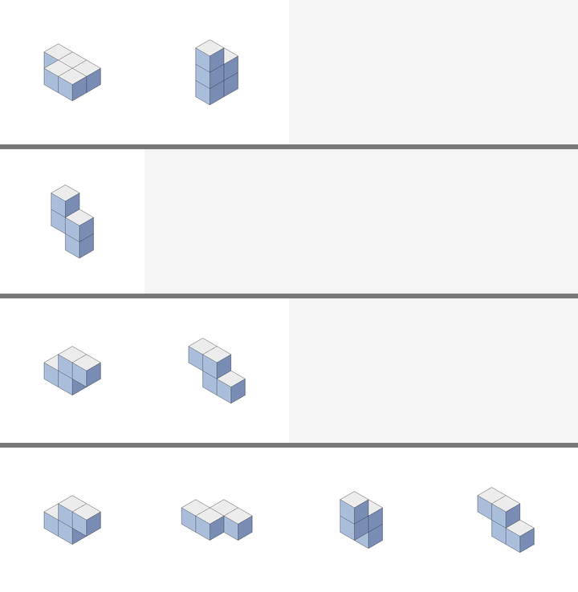

# OpenWM-VLM

Deterministic spatial-reasoning datasets and research groundwork for an independent reproduction of [WM-VLM](https://arxiv.org/abs/2609.34826v1).

[](https://github.com/ahmedjawedaj/open-wm-vlm/actions/workflows/ci.yml)

**Experimental, pre-training stage.** The repository implements Tetris-2D/Tetris-3D generation, rendering, auditing and tests. It does not yet implement the world-model branch, model training, model evaluation or checkpoints. Causal controls and Tiny-WM are proposed experiments. No paper accuracy has been reproduced here.

This project is not affiliated with the paper's authors. These are independently reconstructed datasets with documented deviations, not the original benchmark. See the [dataset card](docs/dataset_card.md) and [implemented protocol](docs/dataset_protocol.md).

## Quick start

Python 3.10+ and a CPU are sufficient. Run from the repository root. A virtual environment is recommended.

```bash
python3 -m venv .venv
source .venv/bin/activate
python -m pip install -c constraints-dev.txt -e '.[dev]'
make check
make data WORKERS=4
make audit
make previews
```

`make data` writes symbolic JSONL and a manifest under `data/`. Generation refuses to overwrite existing dataset files. To regenerate, choose a new output directory using `scripts/generate_data.py`. The first 3D run enumerates shape classes and may take several minutes depending on CPU speed. The full audit regenerates every sample and also takes several minutes. Generated data, previews, environments and checkpoints are ignored by Git.

Without Make, use `python -m pytest -q` and `python -m ruff check src tests scripts`. Generate and audit one dataset:

```bash
python scripts/generate_data.py --config configs/dataset/tetris2d.json --out data/tetris2d
python scripts/dataset_stats.py --config configs/dataset/tetris2d.json --data data/tetris2d --out docs/dataset_stats_tetris2d.md
```

Use `--no-extra` to omit the optional trace-length split. The audit supports both forms. `--skip-regen` checks integrity and membership only and explicitly reports that regeneration was skipped.

## Dataset format

Each question shows a reference shape before and after a shared rotation, then a query and four answer options. Records include exact symbolic states and action traces for supervision.

| Dataset | Train | Evaluation |
|---|---:|---|
| Tetris-2D | 4,000 | `id_test`: 400, `ood_test`: 500 |
| Tetris-3D | 16,000 | `sc_id_test`: 400, `c_id_test`: 400, `ood_test`: 500 |
| Optional, both | | `depth3_test`: 400, three-action supervision traces |

A sample regenerates from `(config, split, index, variant)`. The builder selects variants in a fixed order to exclude repeated symbolic questions across splits. Mirror-related classes stay together. Held-out and OOD pools are disjoint from train, including reference shapes. Manifest hashes cover UTF-8 JSONL bytes, not rendered pixels. Use the pinned environment for reproducibility.

Images are 532 × 532 RGB and rendered on demand. The 19 × 19 token grid is a target for Qwen preprocessing with compatible settings, not a processor integration tested by this repository. A single 3D view can hide cubes, so symbolic answer uniqueness does not guarantee visual identifiability.

For ordinary inference, use only `sample['question']` and `wm_vlm.data.viz.question_images(sample, config.canvas)`. `actions`, `steps`, `states`, `answer` and `answer_label` contain supervision. `sample_sheet` includes ground-truth states and must not be passed to a baseline as the question image.

## Example

The diagnostic sheet below shows the reference pair, query, supervised intermediate states, and options A–D from top to bottom. Correct option: D. The sheet includes supervision and is not an inference input.



[View the 2D example](docs/assets/tetris2d-example.png).

## Contributing

Start with [CONTRIBUTING.md](CONTRIBUTING.md), our [code of conduct](CODE_OF_CONDUCT.md), and [open issues](https://github.com/ahmedjawedaj/open-wm-vlm/issues). Contributions include evaluation infrastructure, symbolic reasoning checks and visual ambiguity diagnostics. CPU-only contributions are welcome.

Pull requests run CI on Python 3.10, 3.12 and 3.13. Changes to the dataset protocol require a generator-version bump and updated full audit reports. See [SECURITY.md](SECURITY.md) for private vulnerability reporting.

## License and citation

[MIT](LICENSE) applies to this repository's code, documentation and independently generated samples and previews. No third-party weights or original dataset files are bundled. External models retain their own licenses. See [CITATION.cff](CITATION.cff) and cite the original paper separately.
